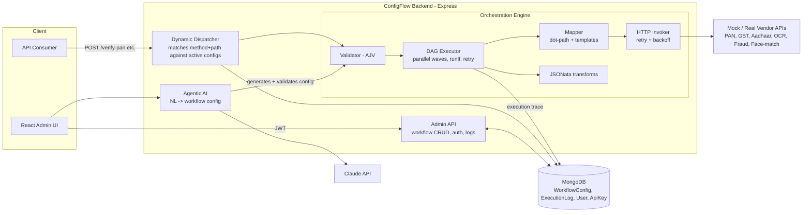

# Architecture

## System overview

## Request lifecycle (dynamic dispatcher)

1. A client calls `POST /verify-pan` (or any path a user has configured).
2. `dispatcherMiddleware` looks up an **active** `WorkflowConfig` matching method+path
   (in-memory cache, invalidated whenever a workflow is created/updated/activated/deleted).
3. The request body is validated against the workflow's `requestSchema` (AJV).
4. The **executor** runs `steps[]` as a DAG: steps whose `dependsOn` are all satisfied
   run concurrently in the same "wave" (this is what gives parallel branches, e.g.
   fraud-check + face-match firing at once after OCR completes). Each step is one of:
   - `callApi` - maps context into a request body/headers/url (mapper.js), invokes the
     downstream API (invoker.js) with retry+exponential backoff on network errors or
     configured status codes.
   - `transform` - evaluates a JSONata expression against `{ input, steps, params }` to
     reshape/merge prior step outputs.
   - Any step may carry `runIf` (a JSONata boolean expression) to skip conditionally,
     and `onError: abort|skip|continue` to control failure propagation.
5. The workflow's `response.mapping` (simple dot-path) or `response.expression`
   (JSONata, for complex merges) builds the final response body.
6. Every execution - success or failure, per-step timings and errors - is persisted to
   `ExecutionLog` and returned in a standardized `{ success, data, error, meta }` envelope.

## Why MongoDB

Workflow "steps" have a shape that varies by `type` (`callApi` vs `transform`), and the
whole point of the platform is that configs are edited/versioned at runtime without a
redeploy. Mongo's flexible schema fits the variable step shape naturally, while the AJV
meta-schema (`engine/workflowConfigSchema.js`) enforces correctness at the API boundary
instead of at the database layer.

## Why JSONata for transforms/conditions

Rather than writing (and securing) a custom expression language or resorting to
`eval()`, transform steps, `runIf` conditions, and complex response merges are all
JSONata expressions evaluated against the execution context. JSONata is a mature,
sandboxed JSON query/transform language purpose-built for exactly this "reshape and
merge JSON" use case. Simple field mapping (request body construction, straightforward
response shaping) uses a lighter declarative `{"field": "$.input.x"}` dot-path mapping
instead, since most cases don't need a full expression language.

## Versioning model

Each `WorkflowConfig` document is one version (`name` + `version`), with exactly one
`isActive: true` per `name`. Publishing a new version (`PUT /admin/workflows/:name`)
deactivates the previous version and activates the new one; `POST
/admin/workflows/:name/activate/:version` rolls back/forward to any historical version.
The dynamic dispatcher only ever matches active versions.

## Frontend

The React admin UI is a thin client over the same admin REST API anyone else could
call: a workflow list, a visual step editor (React Flow - drag connections between
steps to wire `dependsOn`, edit each step's config in a side panel), a test console
that calls the generated endpoint directly, an execution-log viewer, and a "Generate
from description" action that calls the Agentic AI endpoint.
