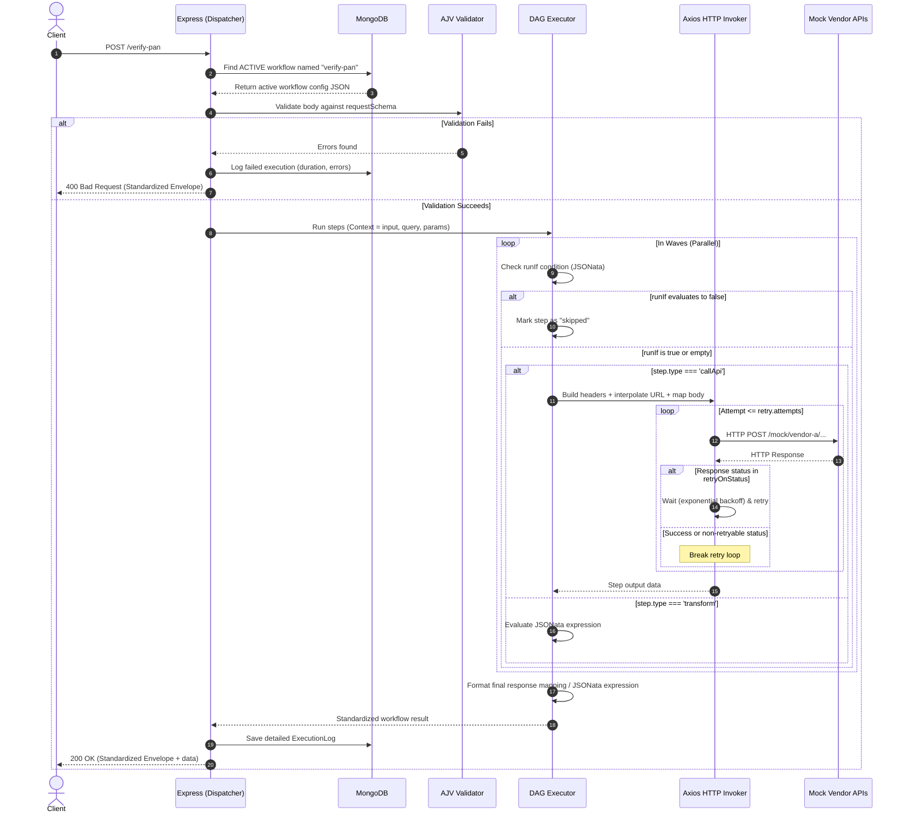

# ConfigFlow: Low-Code API Orchestration Platform Explanation

This document provides a comprehensive breakdown of the **ConfigFlow** architecture, codebase, and mock vendor system. It is designed to help you thoroughly understand how every requirement of the assignment is satisfied, how the internal engine works under the hood, and how to verify it.

---

## 1. System Architecture & Request Lifecycle

ConfigFlow is built on the **MERN** stack (MongoDB, Express, React, Node.js). Instead of hardcoding API routes, it features a **Dynamic Dispatcher** that catches incoming client requests, looks up the corresponding JSON workflow configuration in MongoDB, and executes it on the fly.

### Request Flow Diagram



---

## 2. Requirements Checklist & Code Mapping

Here is how the system satisfies every requirement stated in the SDE-1 Assignment SOW:

| SOW Requirement | Satisfied? | Implementation Details & Code Reference |
| :--- | :--- | :--- |
| **1. Dynamic API creation via config** | **Yes** | Configurations are stored in MongoDB. Admin API provides CRUD endpoints to write/version configs: `POST /admin/workflows` and `PUT /admin/workflows/:name` in [workflows.routes.js](file:///d:/Projects/ConfigFlow/backend/src/routes/admin/workflows.routes.js). |
| **2. Accept incoming REST requests** | **Yes** | The [dispatcher.js](file:///d:/Projects/ConfigFlow/backend/src/routes/dynamic/dispatcher.js) acts as a catch-all router (`app.use(dispatcherMiddleware)` in [app.js](file:///d:/Projects/ConfigFlow/backend/src/app.js#L46)). It inspects `req.path` and matches it against active workflows. |
| **3. Validate incoming payloads** | **Yes** | Every workflow includes a JSON Schema (`requestSchema`). The dispatcher compiles this schema on demand using AJV in [validator.js](file:///d:/Projects/ConfigFlow/backend/src/engine/validator.js#L14) and validates the payload before execution. |
| **4. Map fields to downstream APIs** | **Yes** | Declarative mapping using `$.input.fieldName` maps request variables. Simple interpolation is handled via double-curly braces `{{input.param}}` in URLs/headers. Implemented in [mapper.js](file:///d:/Projects/ConfigFlow/backend/src/engine/mapper.js). |
| **5. Invoke external/mock APIs** | **Yes** | Executed via `callApi` step type. Handled by Axios in [invoker.js](file:///d:/Projects/ConfigFlow/backend/src/engine/invoker.js). |
| **6. Transform/combine responses** | **Yes** | Supports `transform` step types and `response.expression` using **JSONata** in [jsonataEval.js](file:///d:/Projects/ConfigFlow/backend/src/engine/jsonataEval.js) to query, filter, reshape, and merge JSON datasets. |
| **7. Return standardized response** | **Yes** | All responses use a strict payload envelope `{ success, data, error, meta }` helper implemented in [responseEnvelope.js](file:///d:/Projects/ConfigFlow/backend/src/utils/responseEnvelope.js) and applied in [dispatcher.js](file:///d:/Projects/ConfigFlow/backend/src/routes/dynamic/dispatcher.js#L108). |
| **8. Zero-downtime configuration** | **Yes** | Dynamic dispatcher pulls active workflows from the cache. Updates in MongoDB automatically invalidate this cache (`invalidateDispatchCache()` in [dispatcher.js](file:///d:/Projects/ConfigFlow/backend/src/routes/dynamic/dispatcher.js#L22)), going live instantly without reloading the process. |
| **9. Retry mechanism** | **Yes** | Per-step `retry` configuration (`attempts`, `backoffMs`, `retryOnStatus`). Network failures and custom HTTP statuses trigger exponential backoff: `backoffMs * 2 ** attempt` in [invoker.js](file:///d:/Projects/ConfigFlow/backend/src/engine/invoker.js#L67). |
| **10. Conditional execution** | **Yes** | Steps support `runIf` expressions (JSONata statements evaluating to boolean). If false, the step is bypassed and marked as `skipped` in [executor.js](file:///d:/Projects/ConfigFlow/backend/src/engine/executor.js#L55). |
| **11. Error handling** | **Yes** | Configurable step-level error strategies (`onError: "abort" \| "skip" \| "continue"`). Implemented in [executor.js](file:///d:/Projects/ConfigFlow/backend/src/engine/executor.js#L76). |
| **12. Execution logging** | **Yes** | Standard Mongoose model `ExecutionLog` stores the exact status, duration, error, inputs, and output of every single execution step in [ExecutionLog.js](file:///d:/Projects/ConfigFlow/backend/src/models/ExecutionLog.js). |
| **Bonus: Visual workflow editor** | **Yes** | Implemented using **React Flow** in frontend pages. Drag arrows to set dependencies (`dependsOn`), fill step properties in a side panel, and trigger workflows in a live Test Console. |
| **Bonus: API Auth** | **Yes** | Supports **JWT** admin login and **API Keys** (`x-api-key` header) for dynamic endpoints opting into `authRequired: true` in [dispatcher.js](file:///d:/Projects/ConfigFlow/backend/src/routes/dynamic/dispatcher.js#L49). |
| **Bonus: Versioned APIs** | **Yes** | Mongoose database holds historical records (`version: Number`). Admin API rolls versions forward/backward, and ensures only one version is active (`isActive: true`) in [workflows.routes.js](file:///d:/Projects/ConfigFlow/backend/src/routes/admin/workflows.routes.js). |
| **Bonus: Rate limiting** | **Yes** | Globally applied Express rate limiting in [rateLimiter.js](file:///d:/Projects/ConfigFlow/backend/src/middleware/rateLimiter.js). |
| **Bonus: Docker & compose** | **Yes** | Dockerfiles provided for `backend` and `frontend`, and a multi-container orchestrator in [docker-compose.yml](file:///d:/Projects/ConfigFlow/docker-compose.yml). |
| **Bonus: Swagger / OpenAPI** | **Yes** | Interactive documentation loaded at `/docs` in [app.js](file:///d:/Projects/ConfigFlow/backend/src/app.js#L32) via [swagger.js](file:///d:/Projects/ConfigFlow/backend/src/docs/swagger.js). |
| **Agentic AI Bonus** | **Yes** | Conversational prompt converts a description into a full, valid workflow JSON configuration. Implemented in [generate.routes.js](file:///d:/Projects/ConfigFlow/backend/src/routes/agent/generate.routes.js). |

---

## 3. Mock Vendors & Mock Data Architecture

To simulate enterprise vendors, the backend mounts a dedicated mock router in [mockVendors.routes.js](file:///d:/Projects/ConfigFlow/backend/src/mock-vendors/mockVendors.routes.js) on path `/mock`. Each vendor endpoint returns deterministic outputs based on the input payload, simulating normal, error, and recovery paths.

Here is a summary of each mock vendor endpoint:

### A. Vendor A: PAN Verification
* **Endpoint**: `POST /mock/vendor-a/verify-pan`
* **Request**: `{ "pan": "ABCDE1234F" }`
* **Behavior**:
  * Simulates a `150ms` database delay.
  * Validates PAN format `/^[A-Z]{5}([0-9]{4})[A-Z]$/`. If invalid, returns status `INVALID_FORMAT`.
  * Simulates a "Not Found" case: if the 4-digit block ends with `0` (e.g. `ABCDE1230F`), returns status `NOT_FOUND`.
  * For all other valid PAN formats, returns status `SUCCESS`, mapping the simulated owner name `"RAHUL SHARMA"` and type `"Individual"`.

### B. Vendor B: GST Details
* **Endpoint**: `POST /mock/vendor-b/gst-details`
* **Request**: `{ "gstin": "29ABCDE1234F1Z5" }`
* **Behavior**:
  * Simulates a `150ms` delay.
  * Checks length: if length is not exactly 15 characters, returns status `INVALID`.
  * Otherwise returns status `SUCCESS` along with company legal name `"Rahul Sharma Enterprises"`, filing status `"ACTIVE"`, and registration date `"2019-04-01"`.

### C. Aadhaar Validator
* **Endpoint**: `POST /mock/aadhaar/validate`
* **Request**: `{ "aadhaar": "123456789012" }`
* **Behavior**:
  * Simulates a `150ms` delay.
  * Verifies the input is a 12-digit string and does not start with `0`.
  * Returns `{ "valid": true/false, "aadhaar": "...", "name": "Rahul Sharma" }`.

### D. OCR Document Extractor
* **Endpoint**: `POST /mock/ocr/extract`
* **Request**: `{ "documentUrl": "http://..." }`
* **Behavior**:
  * Simulates `200ms` processing delay.
  * Extracts metadata from document URL. Returns status `SUCCESS` and mock fields: name `"Rahul Sharma"`, date of birth `"1990-05-14"`, and ID number `"ID1234567"`.

### E. Fraud Detector
* **Endpoint**: `POST /mock/fraud/check`
* **Request**: `{ "name": "Rahul Sharma" }`
* **Behavior**:
  * Simulates a `120ms` delay.
  * Checks if the name contains the word `"fraud"` (case-insensitive). If so, returns risk score `0.92` and `flagged: true`. Otherwise returns risk score `0.05` and `flagged: false`.

### F. Face Matching
* **Endpoint**: `POST /mock/face-match/compare`
* **Request**: `{ "selfieUrl": "http://...", "idPhotoUrl": "http://..." }`
* **Behavior**:
  * Simulates a `180ms` delay.
  * Ensures both parameters are present. Returns `match: true` and confidence `0.97` if they match; else returns `match: false` and confidence `0.0`.

### G. Flaky Endpoint (Retry Mechanism Demo)
* **Endpoint**: `POST /mock/flaky/echo`
* **Request**: `{ "attemptKey": "demo-key-1", "failTimes": 2 }`
* **Behavior**:
  * Increments a counter for `attemptKey` in an in-memory Map.
  * If the counter is less than or equal to `failTimes`, it returns an **HTTP 503 Service Unavailable** error.
  * Once the counter exceeds `failTimes`, it returns **HTTP 200 OK** and echoes back the request.
  * This is used by the `retry-demo` workflow to prove that exponential backoff retries actually recover.

---

## 4. Deep Dive into the Engine Execution Loop

The orchestration magic is inside [executor.js](file:///d:/Projects/ConfigFlow/backend/src/engine/executor.js). Here is a detailed look at how it solves key distributed-system orchestration problems:

### DAG Resolution (Parallel Waves)
1. The executor groups step dependencies.
2. Inside `while (pending.size > 0 && !aborted)`, it identifies steps in the graph that have **no remaining dependencies** (or whose dependencies have already run successfully/skipped).
3. These "ready" steps are run in parallel using `Promise.all`:
   ```javascript
   await Promise.all(ready.map(async (id) => { ... }))
   ```
4. This ensures that independent branches (such as executing Face Match and Fraud Check in Example 3) execute **in parallel**, matching optimal API throughput characteristics.

### Conditional Execution (`runIf`)
Before running any step, the engine evaluates its `runIf` condition using JSONata against the runtime context:
```javascript
const shouldRun = await evalCondition(step.runIf, context);
```
If it returns `false`, the step status is marked as `"skipped"` and output is stored as `null`. Any steps depending on this step are still allowed to evaluate (instead of blocking the entire execution).

### Error Recovery (`onError`)
If a step throws an error during API execution, the engine catches it and evaluates the step's `onError` property:
* **`abort` (Default)**: Immediately interrupts execution and halts further steps, returning HTTP 502 Bad Gateway to the user.
* **`skip` / `continue`**: Logs the error but adds the step to the completed list, allowing dependencies to continue downstream execution.

---

## 5. Declarative Mapping & JSONata Evaluation

ConfigFlow supports two distinct mapping systems depending on complexity:

### A. Declarative Path Mapping (`mapper.js`)
Used for lightweight mappings such as headers, query parameters, URL interpolation, and request body creation.
* **Double Curly Braces**: `{{input.param}}` maps the string value from `context.input.param` into templates like `http://localhost:4000/mock/vendor/{{input.id}}`.
* **Dot-Path Lookup**: Value strings starting with `$.` are looked up dynamically. For example, `$.steps.ocr.output.extractedFields.name` retrieves the OCR results out of the steps context.

### B. JSONata Expressions (`jsonataEval.js`)
For complex merging, conditional response formatting, or calculations, the platform embeds **JSONata**—a lightweight, sandboxed JSON query and transformation language.
* Example expression in `kyc-onboarding` aggregation:
  ```json
  {
    "name": steps.ocr.output.extractedFields.name,
    "fraudFlagged": steps.fraudCheck.output.flagged,
    "faceMatch": steps.faceMatch.output.match,
    "decision": (steps.fraudCheck.output.flagged = false and steps.faceMatch.output.match = true) ? 'APPROVED' : 'REVIEW_REQUIRED'
  }
  ```

---

## 6. The Agentic AI Feature

The Agentic AI endpoint (`POST /agent/generate-workflow`) takes a plain-English instruction and returns a fully functional JSON configuration.

### How it works:
1. **Model**: Anthropic's Claude is used as the configuration generator.
2. **System Prompt**: Claude is fed an intensive system prompt explaining the ConfigFlow meta-schema structure, mapping syntax, and the mock vendor paths available.
3. **Validation Loop**:
   * Claude outputs a JSON configuration.
   * The backend validates this configuration against the AJV schema (`validateWorkflowConfig`).
   * **Self-Correction Pass**: If AJV validation fails, the backend sends the validation errors back to Claude:
     > *"Your previous JSON failed validation with these errors: [...]. Fix it and return corrected JSON only."*
   * Claude corrects the schema mistakes and outputs the updated config, achieving high reliability.

---

## 7. How to Run, Seed, and Test

### Execution Setup
1. **Manual Start**:
   * Backend: Run `npm install`, `cp .env.example .env`, and `npm run dev` inside `/backend` (runs on `http://localhost:4000`).
   * Frontend: Run `npm install`, `cp .env.example .env`, and `npm run dev` inside `/frontend` (runs on `http://localhost:5173`).
2. **Docker Compose**:
   * Run `docker-compose up --build` in the root folder.
3. **Database Seeding**:
   * Run `npm run seed` inside `/backend` (or `docker-compose exec backend npm run seed`).
   * This seeds an admin user, creates the API key `cf_demo_...`, and registers the 4 sample configurations.

### Key curl Verifications

#### 1. Example 1: Verify PAN (Successful)
```bash
curl -X POST http://localhost:4000/verify-pan \
  -H "Content-Type: application/json" \
  -d '{"pan":"ABCDE1234F"}'
```
* **What happens**: The system validates the PAN format, issues a mock call to `/vendor-a/verify-pan`, transforms the output to `verified: true`, logs the execution, and returns `success: true`.

#### 2. Example 1: Verify PAN (Simulate Not Found)
```bash
curl -X POST http://localhost:4000/verify-pan \
  -H "Content-Type: application/json" \
  -d '{"pan":"ABCDE1230F"}'
```
* **What happens**: The 4-digit block ends with `0`, causing Vendor A to return `status: NOT_FOUND`. The transformation outputs `verified: false`.

#### 3. Example 2: Identity Validation (Aadhaar + GST - Full execution)
```bash
curl -X POST http://localhost:4000/validate-identity \
  -H "Content-Type: application/json" \
  -d '{"aadhaar":"123456789012","gstin":"29ABCDE1234F1Z5"}'
```
* **What happens**: Step 1 validates Aadhaar. Step 2 (GST lookup) depends on Aadhaar and is allowed to run because `steps.aadhaar.output.valid` evaluates to `true`. Both results are merged.

#### 4. Example 2: Identity Validation (Aadhaar invalid -> GST skipped)
```bash
curl -X POST http://localhost:4000/validate-identity \
  -H "Content-Type: application/json" \
  -d '{"aadhaar":"023456789012","gstin":"29ABCDE1234F1Z5"}'
```
* **What happens**: Aadhaar starts with `0` (invalid). The step `gst` evaluates `runIf: "steps.aadhaar.output.valid = true"`. Since Aadhaar is invalid, `gst` is skipped and marked as `skipped` in the logs, bypassing Vendor B entirely.

#### 5. Example 3: KYC Onboarding (Auth required, Parallel Face Match + Fraud Check)
Ensure you use the API Key generated during database seed:
```bash
curl -X POST http://localhost:4000/kyc-onboarding \
  -H "Content-Type: application/json" \
  -H "x-api-key: YOUR_SEED_DEMO_API_KEY" \
  -d '{"documentUrl":"https://example.com/doc.png","selfieUrl":"https://example.com/selfie.png"}'
```
* **What happens**: Authenticates API Key. Runs OCR extraction. Once OCR finishes, it invokes Fraud Check and Face Match **in parallel**. Once both complete, it aggregates results and returns the outcome.
